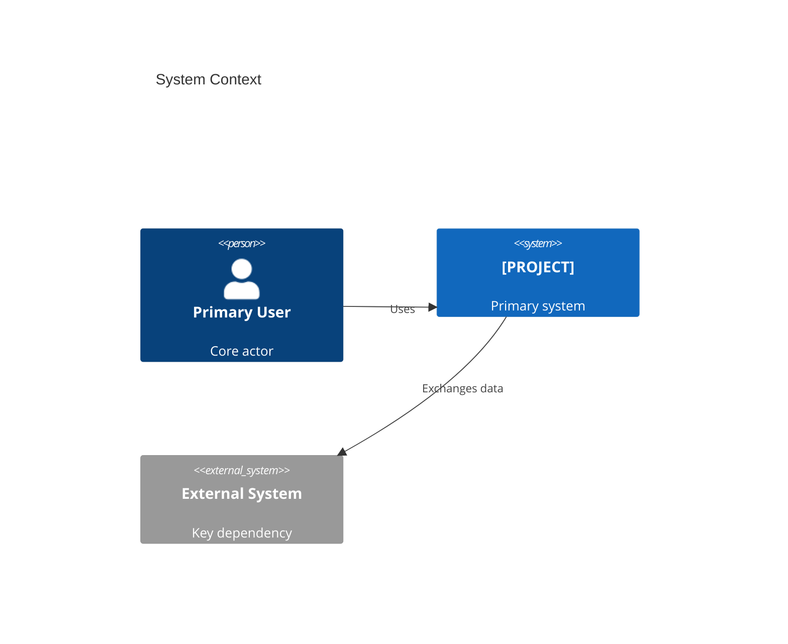
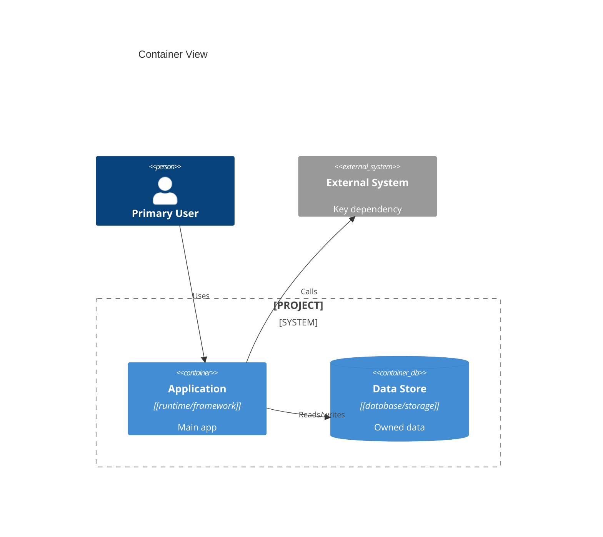
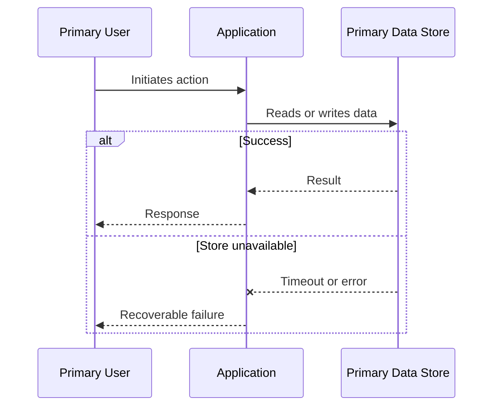
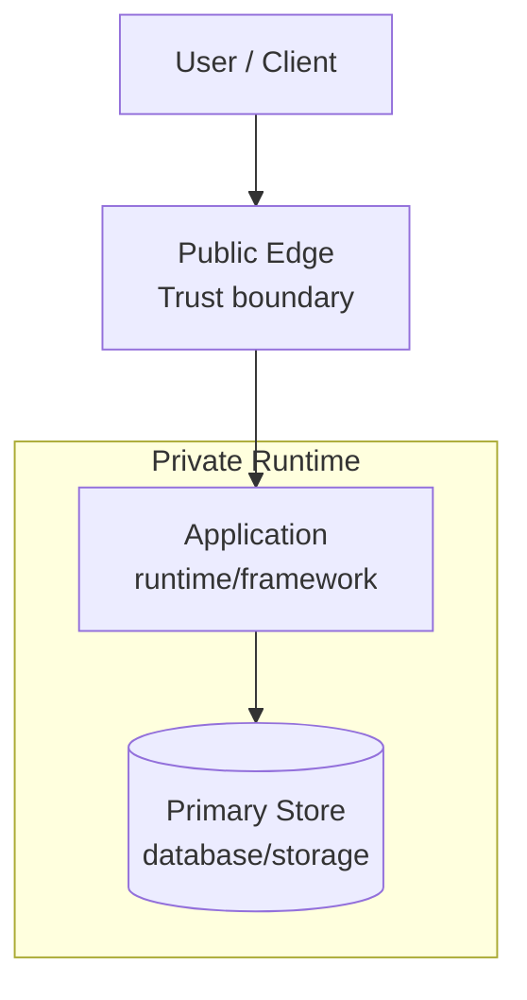

# Software Architecture Document: [PROJECT]

## Purpose and Scope

[Summarize the system purpose, primary problem space, scope, and system boundary.]

## Technical Context

**Language/Version**: [Runtime and language versions by boundary when polyglot] 
**Primary Dependencies**: [Primary frameworks, libraries, and platform dependencies] 
**Storage**: [Stores by owner/boundary, or N/A] 
**Testing**: [Test frameworks and architecture test approach] 
**Target Platform**: [Runtime, hosting, client, edge, or device targets] 
**Project Type**: [single service/web/mobile/platform/library/polyglot] 
**Performance Goals**: [Measurable latency, throughput, interaction, or batch targets] 
**Constraints**: [Regulatory, residency, budget, compatibility, or platform constraints] 
**Scale/Scope**: [Users, tenants, events, data volume, regions, or deployment scope]

## System Decomposition

| Boundary | Responsibilities | Data Ownership | Exposed Interfaces | Dependencies | Deployment Independence |
|----------|------------------|----------------|--------------------|--------------|-------------------------|
| [Boundary] | [Owned responsibilities] | [Owned records or N/A] | [API, events, UI, files] | [Required boundaries/systems] | [Independent, coupled, or in-process] |

## System Scope and Context

[Describe primary users, external systems, business/domain context, trust boundaries, and exclusions.]

### C4 System Context

### C4 Container View

## Architecture View Catalog

| View | Concern | Scope | Notation | Rationale |
|------|---------|-------|----------|-----------|
| System Context | Actors and external dependencies | Whole system | C4 Context | Required overview |
| Container View | Runtime and data boundaries | Whole system or named scope | C4 Container | Required overview |
| [Additional View] | [Question answered] | [Domain/trust zone/runtime/region] | [Sequence/Flowchart/State/ER/C4 Component] | [Why needed] |

## Solution Strategy and Architecture Style

- **Architecture Style**: [Modular monolith, service-oriented, event-driven, serverless, or hybrid]
- **Source Code Layout**: [Adopted project layout; preserve established brownfield layout]
- **Why this style fits**: [Brief rationale tied to constraints and quality attributes]
- **Alternatives considered**: [Rejected approach and primary tradeoff]

## Major Data Flow Catalog

| Flow ID | Trigger | Source / Actor | Processing Boundaries | Stores | Egress | Trust / Data Class | Consistency / Transaction | Failure / Recovery | Diagram |
|---------|---------|----------------|-----------------------|--------|--------|--------------------|---------------------------|--------------------|---------|
| FLOW-001 | [Trigger] | [Source] | [Boundary sequence] | [Stores or N/A] | [Destination or response] | [Trust crossings and classification] | [Consistency/transaction boundary] | [Timeout, retry, fallback, compensation, replay, or recovery] | FLOW-001 |

## Major Data Flow Diagrams

### FLOW-001: [Flow Name]

[State retry limits, idempotency, compensation, dead-letter/replay, fallback, or operator recovery when material.]

## Additional Architecture Views

[Include only selected views. Use sequence diagrams for temporal behavior, flowcharts for async/data/trust/deployment paths, state diagrams for lifecycles, ER diagrams for conceptual ownership, and C4 Component only for materially complex containers.]

## Deployment and Trust Topology

[Describe regions/zones, network and identity boundaries, scaling units, failover assumptions, and which details are deferred to the DOD.]

## Cross-Cutting Concerns

### Security

[Authentication, authorization, identity propagation, secrets, tenancy, trust boundaries, data classification, and compliance posture.]

### Reliability

[Availability targets, retry/fallback, idempotency, degradation, recovery, RTO, and RPO.]

### Observability

[Logs, metrics, traces, correlation, audit events, alerting, and diagnostic ownership.]

### Data Management

[Ownership, lineage, lifecycle, retention/deletion, migration, consistency, residency, and backup expectations.]

### Integration Strategy

[Protocols, contracts, versioning, compatibility, event semantics, and external dependency isolation.]

### Operations

[Operational ownership, environments, release assumptions, support boundaries, and DOD handoff.]

## Quality Attributes

| Attribute | Target | Measurement | Architectural Response |
|-----------|--------|-------------|------------------------|
| Performance | [Measurable target] | [Measurement method] | [Design response] |
| Reliability | [Measurable target] | [Measurement method] | [Design response] |
| Security | [Measurable target] | [Measurement method] | [Design response] |
| Maintainability | [Measurable target] | [Measurement method] | [Design response] |
| Scalability | [Measurable target] | [Measurement method] | [Design response] |

## Architecture Traceability

| Capability / Objective | Boundary | Major Flow | Quality Target | ADRs |
|------------------------|----------|------------|----------------|------|
| [P1 capability or objective] | [Boundary] | FLOW-001 | [Attribute target] | [ADR-NNNN or N/A] |

## Architecture Decision Records

Project-level architectural decisions are maintained as standalone MADR files under `specs/adrs/`. This table is a navigational index; full decision records live in the linked files.

| ADR ID | Title | Status | Date | Supersedes | File |
|--------|-------|--------|------|------------|------|
| ADR-0001 | [Decision Title] | accepted | [DATE] | - | [0001-decision-title.md](adrs/0001-decision-title.md) |

<!-- Rows are managed by the ADR Author subagent. Do not embed full decision prose here. -->

## Risks, Assumptions, Constraints, and Open Questions

### Risks

- [Risk and why it matters]

### Assumptions

- [Assumption that influences the architecture]

### Constraints

- [Hard constraint that limits design choices]

### Open Questions

- [Question that still needs a decision, or None]

## Project Context Baseline Updates

- [Reusable project-level technical context promoted from downstream planning runs, or None]
