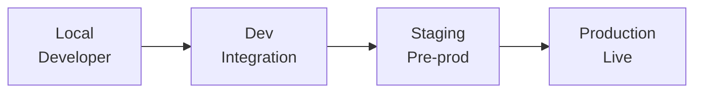
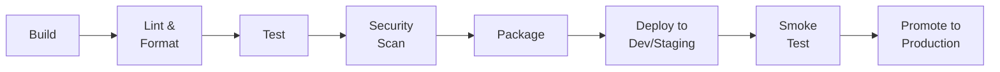
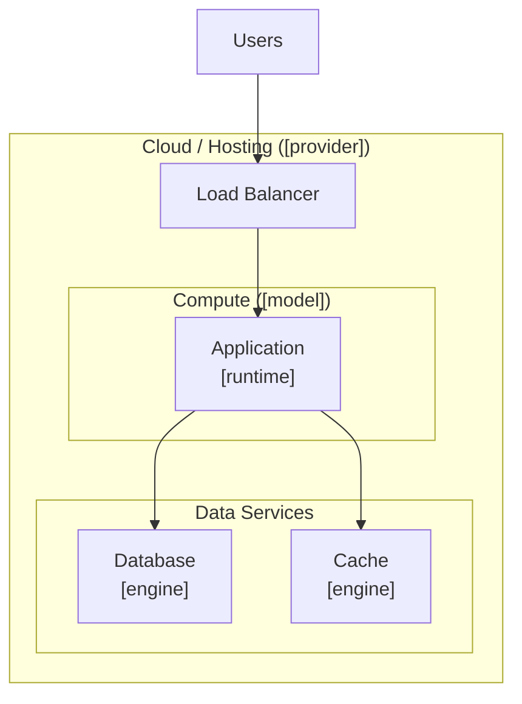

# Deployment & Operations Document: [PROJECT]

> Date: [DATE] | Status: Draft

## Deployment Summary and Context

[Summarize the deployment goals, operational priorities, and how this document complements the architecture. Avoid meta statements about the document itself.]

## Environment Strategy

| Environment | Purpose | Promotion Gate | Data Strategy | Parity with Prod |
|-------------|---------|---------------|---------------|------------------|
| Local | [Developer workstation] | [None] | [Seed/fixtures] | [Minimal] |
| Dev | [Integration testing] | [CI pass] | [Synthetic] | [Partial] |
| Staging | [Pre-production validation] | [QA sign-off] | [Anonymized prod subset] | [High] |
| Production | [Live traffic] | [Release approval] | [Real] | [Baseline] |

### Environment Flow

### Feature Flags and Progressive Rollout

- **Feature flag approach**: [e.g. LaunchDarkly, Unleash, custom, none]
- **Rollout strategy**: [e.g. canary → percentage ramp → full, blue-green, A/B]
- **Rollback trigger**: [e.g. error rate > threshold, manual, automated]

## Deployment Targets and Packaging

- **Deployment model**: [e.g. container images, standalone executable, serverless functions, static site, mobile bundles, hybrid]
- **Build artifact**: [e.g. Docker image, binary, .zip, .ipa/.aab]
- **Container registry**: [e.g. Docker Hub, ECR, GCR, GHCR, ACR — if applicable]
- **Image tagging strategy**: [e.g. git SHA, semver, latest + immutable]
- **Vulnerability scanning**: [e.g. Trivy, Snyk Container, built-in registry scanning]
- **App store distribution**: [e.g. TestFlight, Play Console — if applicable]
- **Edge/CDN**: [e.g. CloudFront, Cloudflare, Vercel Edge — if applicable]

## CI/CD Pipeline Design

### Pipeline Stages

- **Pipeline tooling**: [e.g. GitHub Actions, GitLab CI, Jenkins, CircleCI]
- **IaC approach**: [e.g. Terraform, Pulumi, CloudFormation, CDK, none]
- **Deployment method**: [e.g. GitOps with ArgoCD/Flux, push-based, platform-managed]
- **Rollback automation**: [e.g. automated revert on health check failure, manual, blue-green switch]
- **Zero-downtime strategy**: [e.g. rolling update, blue-green, canary]
- **Secrets in pipeline**: [e.g. GitHub Secrets, Vault, cloud KMS, sealed secrets]

## Infrastructure and Hosting

- **Cloud provider**: [e.g. AWS, GCP, Azure, self-hosted, multi-cloud]
- **Compute model**: [e.g. Kubernetes, ECS/Fargate, App Service, Lambda, VMs, PaaS]
- **Networking**: [VPC layout, load balancer type, DNS strategy, TLS/certificate management]
- **Storage infrastructure**: [managed vs. self-hosted databases, backup approach, replication]
- **Cost estimation approach**: [e.g. cloud calculator, FinOps practice, fixed budget cap]
- **Budget constraints**: [e.g. monthly target, cost alerts, reserved instances]

### Infrastructure Diagram

## Observability and Monitoring

### Logging
- **Approach**: [e.g. structured JSON logging, log levels]
- **Aggregation**: [e.g. ELK, Loki, CloudWatch Logs, Datadog Logs]
- **Retention**: [e.g. 30 days hot, 1 year cold]

### Metrics
- **Application metrics**: [e.g. request rate, error rate, latency percentiles]
- **Infrastructure metrics**: [e.g. CPU, memory, disk, network]
- **DORA metrics**: [deployment frequency, lead time, change failure rate, MTTR]
- **Tooling**: [e.g. Prometheus + Grafana, Datadog, CloudWatch]

### Tracing
- **Distributed tracing**: [e.g. OpenTelemetry, Jaeger, AWS X-Ray, Datadog APM]
- **Correlation**: [e.g. trace ID propagation, request ID headers]

### Alerting
- **Alert routing**: [e.g. PagerDuty, Opsgenie, Slack, email]
- **On-call schedule**: [e.g. weekly rotation, follow-the-sun]
- **Escalation policy**: [e.g. 5 min ack → escalate to secondary → escalate to manager]

### SLI/SLO
| Service | SLI | SLO Target | Error Budget | Measurement |
|---------|-----|------------|-------------|-------------|
| [Service] | [e.g. availability] | [e.g. 99.9%] | [e.g. 43.8 min/month] | [e.g. uptime probe] |
| [Service] | [e.g. latency p99] | [e.g. < 500ms] | [e.g. 0.1% requests] | [e.g. APM histogram] |

## Reliability Engineering

- **Availability target**: [e.g. 99.9% = 8.77h downtime/year]
- **RPO** (Recovery Point Objective): [e.g. 1 hour — max acceptable data loss]
- **RTO** (Recovery Time Objective): [e.g. 30 minutes — max acceptable downtime]

### Disaster Recovery
- **Backup strategy**: [e.g. daily snapshots, continuous replication, point-in-time recovery]
- **Failover mechanism**: [e.g. multi-AZ, multi-region, cold standby]
- **DR testing cadence**: [e.g. quarterly, annually]

### Capacity and Scaling
- **Scaling approach**: [e.g. horizontal auto-scaling, vertical, manual]
- **Scaling triggers**: [e.g. CPU > 70%, queue depth > 100, custom metrics]
- **Load testing**: [e.g. k6, Locust, Artillery — cadence and targets]

### Incident Management
- **Incident process**: [e.g. detect → triage → mitigate → resolve → postmortem]
- **Runbook location**: [e.g. repo wiki, Notion, Confluence]
- **Postmortem policy**: [e.g. blameless, written within 48h, shared team-wide]

### Production Readiness Review
- [Checklist of criteria a service must meet before going live]
- [e.g. monitoring in place, runbooks written, DR tested, load tested, security reviewed]

## Security and Compliance in Operations

### Supply Chain Security
- **SBOM generation**: [e.g. Syft, CycloneDX, none]
- **Dependency scanning**: [e.g. Dependabot, Snyk, Renovate]
- **Artifact signing**: [e.g. cosign, Notary, none]

### Runtime Security
- **WAF / DDoS protection**: [e.g. Cloudflare, AWS Shield, none]
- **Intrusion detection**: [e.g. Falco, GuardDuty, none]
- **Network policies**: [e.g. Kubernetes NetworkPolicy, security groups]

### Secrets Management
- **Secrets store**: [e.g. Vault, AWS Secrets Manager, Azure Key Vault, env vars]
- **Rotation policy**: [e.g. 90-day rotation, automated, manual]
- **Access pattern**: [e.g. injected at deploy time, sidecar, SDK]

### Compliance
- **Applicable frameworks**: [e.g. SOC 2, HIPAA, GDPR, PCI-DSS, none]
- **Audit logging**: [e.g. CloudTrail, audit log service, application-level]
- **Access control for infrastructure**: [e.g. RBAC, SSO, break-glass procedure]

## Operational Ownership and Processes

- **Production ownership model**: [e.g. "you build it, you run it", dedicated SRE team, platform team, shared]
- **On-call structure**: [e.g. per-team rotation, centralized NOC, escalation tiers]
- **Change management**: [e.g. PR-based, change advisory board, automated with guardrails]
- **Release approval process**: [e.g. automated on green CI, manual sign-off, scheduled windows]
- **Documentation expectations**: [e.g. runbooks for every alert, ADRs for infra decisions, onboarding playbook]

### Operational Maturity Roadmap

| Phase | Focus | Key Milestones |
|-------|-------|---------------|
| Crawl | [Basic monitoring, manual deploys] | [e.g. CI pipeline, basic alerts] |
| Walk | [Automated deploys, SLOs defined] | [e.g. CD pipeline, dashboards, runbooks] |
| Run | [Self-healing, chaos engineering, FinOps] | [e.g. auto-remediation, DR drills, cost optimization] |

## Cost Considerations

- **Estimated monthly cost**: [e.g. $X–$Y range]
- **Major cost drivers**: [e.g. compute, data transfer, storage, third-party services]
- **Cost optimization levers**: [e.g. reserved instances, spot/preemptible, right-sizing, caching]
- **Cost monitoring**: [e.g. cloud billing alerts, FinOps dashboard, monthly review]

## Deployment Decisions

### DDR-001: [Decision Title]

- **Status**: Proposed | Accepted | Superseded
- **Context**: [Decision context]
- **Decision**: [What was chosen]
- **Rationale**: [Why it was chosen]
- **Alternatives Considered**: [Alternatives and why they were rejected]
- **Tradeoffs**: [What gets better and worse]
- **Consequences**: [Expected downstream impact]

## Risks, Assumptions, Constraints, and Open Questions

### Risks

- [Risk and why it matters]

### Assumptions

- [Assumption that influences deployment decisions]

### Constraints

- [Hard constraint that limits deployment choices]

### Open Questions

- [Question that still needs a decision]
