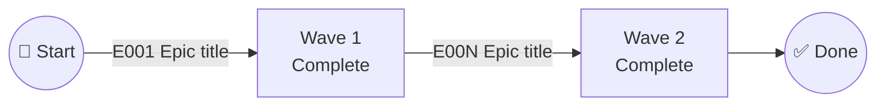

# Project Planner — Project Planning Workflow

<rules>
- This is an optional **project bootstrap** phase. It typically runs after `/sddp-devops` and before `/sddp-init`.
- Work at project level, not feature level.
- Primary output is `specs/project-plan.md`.
- The Product Document (PRD) and Technical Context Document (SAD) are **mandatory** inputs. Halt if either is unresolvable.
- The Deployment & Operations Document (DOD) is optional. When absent, skip operational epic extraction but continue.
- This is a **self-contained analysis workflow** — no external research delegation. All information comes from the bootstrap artifacts.
- Read all available inputs before performing any analysis.
- Each epic must be independently deliverable — completing it produces a working increment.
- P1 epics alone (across all waves) must yield a working, demonstrable MVP.
- Every epic must have at least one traceability tag linking back to a PRD user story, SAD ADR, or DOD DDR.
- Epic titles must be suitable as `$ARGUMENTS` to `/sddp-specify` — human-readable, descriptive, and self-contained.
- The epic checklist format must remain machine-parseable.
- Use standard Mermaid `graph LR` syntax for dependency diagrams. Use `<br>` for line breaks in labels — never `\n`.
- Keep dependency diagrams to ≤30 nodes for readability. For large projects, use a summary diagram plus per-wave detail diagrams.
- Reuse the existing registration flow in `.github/sddp-config.md`. Do not create a parallel registry.
- When refining an existing `specs/project-plan.md`, preserve manually checked `[X]` epics and their completion state.
- Do not mention SDD command names, phase names, or workflow references in the generated `specs/project-plan.md`. Use generic terms like "implementation pipeline" or "feature delivery" instead.
- Avoid filler or obvious meta statements. Prefer concrete project-specific content.
</rules>

<workflow>

## 0. Acquire Baselines

Read these files before proceeding:
- `.github/skills/spec-authoring/SKILL.md` — understand spec types (product, technical, operational) and how epics map to downstream specifications
- `.github/skills/init-project/SKILL.md` — reuse project-level config creation and preservation patterns

## 1. Gate Check — Resolve Input Documents

Read `.github/sddp-config.md` if it exists.

### 1.1 Resolve Product Document

1. Parse `## Product Document` → `**Path**:` from `.github/sddp-config.md`.
2. If the path is non-empty and the file is readable, set `PRODUCT_DOC` to that path.
3. If the path is empty but `specs/prd.md` exists and is readable, set `PRODUCT_DOC = specs/prd.md`.
4. If `PRODUCT_DOC` is still unresolved → **HALT**: "Project planning requires a Product Document. Run `/sddp-prd` first or register an existing one in `.github/sddp-config.md`."

### 1.2 Resolve Technical Context Document

1. Parse `## Technical Context Document` → `**Path**:` from `.github/sddp-config.md`.
2. If the path is non-empty and the file is readable, set `TECH_CONTEXT_DOC` to that path.
3. If the path is empty but `specs/sad.md` exists and is readable, set `TECH_CONTEXT_DOC = specs/sad.md`.
4. If `TECH_CONTEXT_DOC` is still unresolved → **HALT**: "Project planning requires a Technical Context Document. Run `/sddp-systemdesign` first or register an existing one in `.github/sddp-config.md`."

### 1.3 Resolve Deployment & Operations Document

1. Parse `## Deployment & Operations Document` → `**Path**:` from `.github/sddp-config.md`.
2. If the path is non-empty and the file is readable, set `DEPLOY_OPS_DOC` to that path and `HAS_DOD = true`.
3. If the path is empty but `specs/dod.md` exists and is readable, set `DEPLOY_OPS_DOC = specs/dod.md` and `HAS_DOD = true`.
4. If `DEPLOY_OPS_DOC` is still unresolved, set `HAS_DOD = false` and continue.

## 2. Read and Parse All Inputs

Read each resolved document and extract structured content:

### 2.1 Product Document (`PRODUCT_DOC`)
Extract:
- Product name and vision
- User stories with priority assignments (P1, P2, P3)
- Functional requirements (`FR-###`)
- Scope boundaries (in-scope, out-of-scope, future)
- Success criteria

### 2.2 Technical Context Document (`TECH_CONTEXT_DOC`)
Extract:
- Architecture decisions (`ADR-###`) with status, context, and rationale
- Tech stack (language, framework, database, infrastructure)
- Quality attributes and constraints
- Integration architecture and external dependencies
- Cross-cutting concerns (security, observability, error handling)

### 2.3 Deployment & Operations Document (`DEPLOY_OPS_DOC`, if `HAS_DOD = true`)
Extract:
- Deployment decisions (`DDR-###`) with status, context, and rationale
- Environment strategy and promotion flow
- CI/CD pipeline design
- Infrastructure and hosting details
- Observability and monitoring requirements
- Reliability targets

### 2.4 Additional Context
Read if present:
- `project-instructions.md` — project-level constraints that may affect epic scoping
- `README.md` — project context and description

Summarize all discovered inputs into `PROJECT_CONTEXT`.

## 3. Determine Mode

1. If `specs/project-plan.md` exists and contains substantive content (epic checklist with at least one `E###` entry), set `MODE = REFINE`.
2. Otherwise set `MODE = CREATE`.

When `MODE = REFINE`:
- Read the existing plan and preserve any `[X]`-marked (completed) epics.
- Identify epics that need updating, adding, or removing based on changes in the source documents.
- Maintain existing epic IDs for unchanged epics; append new IDs for new epics.

## 4. Decompose into Epics

### 4.1 Product Epics (`[PRODUCT]`)

Decompose PRD user stories into **demo-scoped** epics — each epic delivers exactly one thing you could demo to a stakeholder.

1. For each user story, examine its acceptance scenarios and functional requirements.
2. Apply the **"one demo" test**: imagine the epic just shipped — describe the demo. If the demo covers two independent things (e.g., "manage devices" AND "configure source associations"), split into separate epics.
3. Each distinct demo-able capability becomes its own PRODUCT epic. A single user story often yields 2–4 epics; a tightly focused story may stay as one.
4. Epic title names the **specific capability** being delivered, not just the parent user story title.
5. Tag each epic with `{PRD:US-N}` (or `{PRD:US-N,US-M}` when a capability genuinely spans multiple stories). Do not group unrelated capabilities under one epic just because they share a user story.

### 4.2 Technical Epics (`[TECHNICAL]`)

Identify SAD ADRs requiring standalone implementation:
1. Not every ADR becomes an epic — only those requiring dedicated implementation effort (framework setup, data layer, shared libraries, integration infrastructure).
2. ADRs that are simply constraints or guidelines absorbed by product epics do not need separate epics.
3. Tag with `{SAD:ADR-N}`.

### 4.3 Operational Epics (`[OPERATIONAL]`)

Only when `HAS_DOD = true`:
1. Identify DOD DDRs requiring setup work (CI/CD, environment provisioning, monitoring, IaC).
2. Group related DDRs that would naturally be delivered together.
3. Tag with `{DOD:DDR-N}` or `{DOD:DDR-N,DDR-M}`.

### 4.4 Cross-Cutting Epics

If an epic spans multiple source documents:
1. Assign the primary category based on what dominates its scope.
2. Include traceability tags from all contributing sources (e.g., `{PRD:US-5}{SAD:ADR-003}`).
3. Note the cross-cutting nature in the epic's detail section.

If a needed epic has no direct PRD/SAD/DOD reference (e.g., a cross-cutting concern like error handling framework):
1. Create a tag referencing the closest related item.
2. Note the derivation in the epic's detail section.

## 5. Build Dependency Graph

1. Identify dependencies between epics:
   - Data model dependencies (epic B needs schemas from epic A)
   - API contract dependencies (epic B calls APIs built by epic A)
   - Shared infrastructure dependencies (epic B runs on infrastructure from epic A)
   - Framework dependencies (epic B uses libraries from epic A)

2. Assign epics to waves based on dependency chains:
   - **Wave 1** = epics with no dependencies (foundation)
   - **Wave N+1** = epics whose dependencies are all in Wave N or earlier
   - Minimize the total number of waves while respecting all dependency constraints

3. Within each wave, mark parallelizable epics with `[P]`:
   - An epic is `[P]` if it has no dependencies on other epics in the same wave
   - Epics that share mutable resources (e.g., overlapping database migrations) should NOT be marked `[P]`

4. Identify integration risks and shared-resource conflicts:
   - Parallel epics that touch the same data models or APIs
   - Schema migration conflicts across parallel epics
   - Shared configuration or infrastructure that could create race conditions

## 6. Assign Priorities

1. **P1 product epics** come directly from P1 PRD user stories. When a P1 user story splits into multiple epics, all resulting epics inherit P1 unless the PRD explicitly assigns lower priority to specific capabilities within that story.
2. **Technical/operational prerequisites** of P1 product epics inherit P1 priority.
3. **Transitive priority**: if a P2 epic depends on a technical epic, that technical epic gets at least P2.
4. **Validate MVP**: P1 epics alone (across all waves) should yield a working, demonstrable product.
5. If the MVP validation fails (P1 epics don't form a coherent deliverable), adjust:
   - Promote critical technical prerequisites to P1
   - Flag the issue for user review in Step 8

## 7. Validate Coverage

Check every extractable item from source documents:

### 7.1 PRD Coverage
- Every user story must map to at least one epic.
- Missing coverage → create an epic or justify the exclusion.

### 7.2 SAD Coverage
- Every ADR that implies implementation work must map to at least one epic.
- ADRs that are absorbed into product epics (e.g., "use PostgreSQL" absorbed by a data-layer epic) count as covered.
- Missing coverage → create a technical epic or justify the exclusion.

### 7.3 DOD Coverage (if `HAS_DOD = true`)
- Every DDR that implies setup work must map to at least one epic.
- Missing coverage → create an operational epic or justify the exclusion.

Document intentionally excluded items with rationale in the **Uncovered items** section.

## 8. Present for Review

Display to the user:
1. The complete **epic checklist** organized by waves
2. The **Mermaid dependency diagram** (AoA style)
3. The **execution wave summary** table
4. Coverage validation results (any gaps or exclusions)

Ask the user to confirm:
- Epic granularity — too coarse? too fine?
- Priority assignments — correct P1/P2/P3 distribution?
- Wave groupings and parallel safety — any missed dependencies?
- Missing epics or scope items?

Allow the user to request adjustments. Iterate until confirmed.

## 9. Write `specs/project-plan.md`

Ensure the `specs/` directory exists before writing.

Use the following output structure:

````markdown
---
created: "[DATE]"
prd_source: "[PRODUCT_DOC path]"
sad_source: "[TECH_CONTEXT_DOC path]"
dod_source: "[DEPLOY_OPS_DOC path or N/A]"
---

# Project Implementation Plan

**Product**: [Product name from PRD]
**Created**: [DATE]
**Status**: Draft
**Total Epics**: [N] (P1: [n], P2: [n], P3: [n])
**Estimated Waves**: [N]

## Epic Checklist

### Wave 1 — [Wave title]
> [Brief description of wave scope and parallelism notes]

- [ ] E001 [P#] [CATEGORY] [P?] {source-tags} Epic title — brief scope sentence

### Wave 2 — [Wave title]
> [Dependencies and parallelism notes]

- [ ] E00N [P#] [CATEGORY] [P?] {source-tags} Epic title — brief scope sentence

[Continue for all waves]

## Dependency Diagram



## Execution Wave Summary

| Wave | Epics | All Parallel? | Notes |
|------|-------|---------------|-------|
| 1 | E001, E002 | Yes/No/Partial | Brief note |

## Parallel Execution Guidance

### Independent Epics (safe to parallelize)
- E001 ↔ E002: [Reason they're safe]

### Integration Risks
- [Cross-epic dependency risks]

### Shared Resource Conflicts
- [Any schema, config, or infrastructure conflicts]

## Epic Details

### E001 — [Epic title]
- **Category**: [PRODUCT | TECHNICAL | OPERATIONAL]
- **Priority**: [P1 | P2 | P3]
- **Source**: {source-tags}
- **Scope**: [2-3 sentences expanding the brief scope]
- **Depends on**: [Epic IDs or "None (Wave 1)"]
- **Depended on by**: [Epic IDs or "None"]
- **Acceptance criteria**:
  - [ ] [Concrete, verifiable statement of what "done" looks like — e.g., "Operator can add a device with manufacturer, model, and current firmware version"]
  - [ ] [One more criterion per distinct observable outcome]
- **Specify input**: "[Epic title — scope sentence suitable as $ARGUMENTS]"

[Repeat for each epic]

## Coverage Validation

### PRD User Stories
| User Story | Priority | Epic(s) | Covered? |
|---|---|---|---|
| US-1: [title] | P1 | E00N | ✅ |

### SAD Architecture Decisions
| ADR | Epic(s) | Covered? |
|---|---|---|
| ADR-001: [title] | E00N | ✅ |

### DOD Deployment Decisions (if applicable)
| DDR | Epic(s) | Covered? |
|---|---|---|
| DDR-001: [title] | E00N | ✅ |

**Uncovered items**: [List any deliberately excluded items with rationale, or "None"]
````

### Epic Checklist Format Reference

Each epic line must match this machine-parseable format:
```
- [ ] E### [P#] [CATEGORY] [P?] {source-tags} Epic title — brief scope sentence
```

Recommended parsing regex:
```regex
^- \[([ X])\] (E\d{3}) \[(P[123])\] \[(PRODUCT|TECHNICAL|OPERATIONAL)\] (\[P\] )?(\{[^}]+\})+ (.+)$
```

| Field | Description |
|---|---|
| `E###` | Sequential epic ID (E001, E002, …) |
| `[P#]` | Priority tier: P1 = MVP-critical, P2 = important, P3 = nice-to-have |
| `[CATEGORY]` | One of `[PRODUCT]`, `[TECHNICAL]`, `[OPERATIONAL]` |
| `[P]` | Present if the epic is safe to run in parallel with other `[P]` epics in the same wave |
| `{source-tags}` | Traceability tags: `{PRD:US-N}`, `{SAD:ADR-N}`, `{DOD:DDR-N}`, or combinations |
| Title + scope | Human-readable epic name followed by ` — ` and a one-sentence scope description |

### Traceability Tag Formats

| Tag Format | Source | Example |
|---|---|---|
| `{PRD:US-N}` | PRD user story | `{PRD:US-1}` |
| `{PRD:US-N,US-M}` | Multiple PRD user stories | `{PRD:US-1,US-3}` |
| `{SAD:ADR-N}` | SAD architecture decision | `{SAD:ADR-002}` |
| `{DOD:DDR-N}` | DOD deployment decision | `{DOD:DDR-001}` |
| Combined | Multiple sources | `{PRD:US-5}{SAD:ADR-003}` |

### Mermaid Dependency Diagram Rules

Use activity-on-arrow (AoA) style:
- **Nodes** = milestones (project start, wave completions, project end)
- **Arrows** = epics (the work activities)
- Label arrows with `E### Epic title`
- Use `graph LR` syntax
- Use `<br>` for line breaks in labels (never `\n`)
- Parallel epics originate from the same source node
- Keep to ≤30 nodes for readability
- For large projects (>15 epics), use a summary diagram plus per-wave detail diagrams

## 10. Register in Config

Ensure `.github/sddp-config.md` exists. If it does not exist, create it using the current project config structure with:
- Product Document path preserved if known, otherwise `specs/prd.md` if it exists, otherwise blank
- Technical Context Document path preserved if known, otherwise `specs/sad.md` if it exists, otherwise blank
- Deployment & Operations Document path preserved if known, otherwise `specs/dod.md` if it exists, otherwise blank
- Project Plan path set to `specs/project-plan.md`
- `MaxChecklistCount` defaulting to `1`
- Autopilot defaulting to `false`

If `.github/sddp-config.md` already exists:
- Preserve all unrelated sections unchanged.
- Preserve existing Product Document, Technical Context Document, and Deployment & Operations Document paths.
- Add or update `## Project Plan` → `**Path**:` to `specs/project-plan.md`.

The `## Project Plan` section should be placed after `## Deployment & Operations Document` and before `## Checklist Settings`:

```markdown
## Project Plan

<!-- A high-level decomposition of the project into epics with dependency ordering and execution waves. -->
<!-- Registered by /sddp-projectplan when specs/project-plan.md is created. -->

**Path**: specs/project-plan.md
```

## 11. Report

Output:
- **Mode**: `CREATE` or `REFINE`
- **Inputs read**: List each document path and what was extracted
- **Total epics**: Count by category (`[PRODUCT]`, `[TECHNICAL]`, `[OPERATIONAL]`) and priority (P1, P2, P3)
- **Wave count**: Total waves and parallel execution opportunities
- **Coverage validation**: Any gaps or intentionally excluded items
- **Registration**: Confirm `specs/project-plan.md` is written and registered in `.github/sddp-config.md`
- **Suggested next step**: `/sddp-init` — compose a suggested prompt that preserves or adopts the generated project plan

</workflow>
