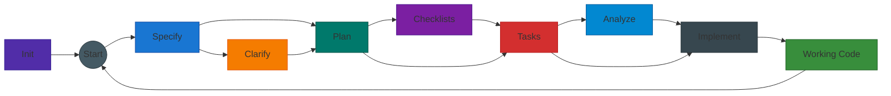

# SDD Pilot

[](LICENSE)
[](https://github.com/attilaszasz/sdd-pilot/releases/latest)
[](https://code.visualstudio.com/)
[](https://marketplace.visualstudio.com/items?itemName=GitHub.copilot)
[](https://github.com/attilaszasz/sdd-pilot/pulls)

Turn GitHub Copilot into a structured, spec-driven delivery workflow.

SDD Pilot helps you build features in phases instead of jumping straight to code. You start with a specification, clarify ambiguity, plan implementation, generate tasks, and only then implement.



> **Heritage:** SDD Pilot evolved from [Spec Kit](https://github.com/github/spec-kit) ([0.0.90](https://github.com/github/spec-kit/releases/tag/v0.0.90)).

## Who this is for

If you are new to spec-driven development, this template gives you:
- A guided phase-by-phase process
- Built-in quality gates (so you do not skip critical steps)
- Structured artifacts under `specs/<feature-folder>/`
- Specialized agents for each phase

> **Compatibility:** SDDP is GitHub Copilot-native in VS Code, and at this point is not compatible with other AI coding tools.

## Prerequisites

- VS Code `1.109.x` or newer
- GitHub Copilot Chat extension installed and enabled
- Active GitHub Copilot access (Free, Pro, or Business)
- Workspace setting `github.copilot.chat.askQuestions.enabled = true` (already configured in `.vscode/settings.json`)

## Model recommendation (important)

You do **not** need the most expensive model tiers for this workflow.

At the time of writing, **GPT-5.3-Codex** is the recommended default model for all SDDP phases (`/sddp.init` through `/sddp.implement`).

## Getting Started

### 1) Add SDD Pilot to your repo

**Option A — Use the GitHub template**

Click **Use this template** on the [SDD Pilot repository](https://github.com/attilaszasz/sdd-pilot) to create a new repo with all files included.

**Option B — Download the latest release**

1. Go to the [Releases page](https://github.com/attilaszasz/sdd-pilot/releases/latest) and download the zip.
2. Extract the contents to the root folder of your project.

### 2) Initialize project laws (`/sddp.init`)

Before building features, define your non-negotiable rules:

```text
/sddp.init My project is a Node.js monorepo using TypeScript.
Principles:
1. Test-Driven Development is mandatory.
2. All APIs must be RESTful.
3. No direct database access from controllers.
```

This populates `.github/copilot-instructions.md`, which acts as project governance. Planning and analysis workflows check these rules.

If `/sddp.init` receives a file as input, that file is registered as the **Product Document** in `.github/sddp-config.md`.

Example (attach/select your product doc when running the command):

```text
/sddp.init Initialize project governance using attached PRD
```

## Core lifecycle (beginner version)

Use this flow for each feature:

```text
/sddp.specify → /sddp.clarify → /sddp.plan → /sddp.checklist (optional) → /sddp.tasks → /sddp.analyze (optional) → /sddp.implement
```

## Feature folder convention

Feature folders are resolved as follows:

- If your current branch matches `#####-feature-name`, `/sddp.specify` uses `specs/<current-branch>/`.
- If your branch does not match that pattern, `/sddp.specify` prompts you to enter the feature folder name under `specs/`.

In both cases, artifacts are written to:

```text
specs/<feature-folder>/
```

Examples:

```text
Current branch: 00007-payment-flow
/sddp.specify Add one-click checkout
→ Uses specs/00007-payment-flow/
```

```text
Current branch: feature/payment-flow
/sddp.specify Add one-click checkout
→ Prompts for feature folder name (for example: 00007-payment-flow)
→ Uses specs/00007-payment-flow/
```

Expected branch pattern:

```text
#####-feature-name
```

Example:

```text
00001-user-auth
```

## What each phase produces

Inside `specs/<feature-folder>/`:

- `/sddp.specify` → `spec.md`
- `/sddp.clarify` → updates `spec.md` with clarifications
- `/sddp.plan` → `plan.md`, `research.md`, `quickstart.md`, and conditionally:
  - `data-model.md` (if data modeling is needed)
  - `contracts/` (if API contracts are needed)
- `/sddp.checklist` (optional) → `checklists/*.md`
- `/sddp.tasks` → `tasks.md`
- `/sddp.analyze` (optional) → analyze and remediate inconsistencies in spec artifacts
- `/sddp.implement` → source code + task completion updates

## Gates (why this flow is reliable)

SDDP enforces order:

- You cannot run planning without `spec.md`
- You cannot generate tasks without `plan.md`
- You cannot implement without `tasks.md`
- Project instructions in `.github/copilot-instructions.md` are treated as law
- If checklists exist and are incomplete, implementation can be gated

## Understanding `.github/sddp-config.md`

`.github/sddp-config.md` stores project-level context shared across SDDP agents.

It has two key document references:

1. **Product Document path**
   - Used to enrich feature specification context
2. **Technical Context Document path**
   - Used by planning and downstream agents for architecture/stack constraints

Important behavior:
- This file is managed by `/sddp.init` and `/sddp.plan`
- If `/sddp.init` receives a file, that file is stored as the **Product Document** path
- If `/sddp.plan` receives a file, that file is stored as the **Technical Context Document** path
- When those files are supplied, agents use their content to build `spec.md` and `plan.md`
- Empty paths are normal when starting a new project
- If referenced files are moved or missing, agents continue best-effort and may warn

Example (attach/select your technical context doc when planning):

```text
/sddp.plan Create implementation plan using attached technical context
```

## Typical day-to-day command sequence

1. Create a feature branch: `git checkout -b 00001-user-auth`
2. Run:
   - `/sddp.specify Build user authentication with email/password`
   - `/sddp.clarify`
   - `/sddp.plan`
   - `/sddp.checklist` (optional but recommended)
   - `/sddp.tasks`
   - `/sddp.analyze` (optional but recommended)
   - `/sddp.implement`
3. (Optional) Run `/sddp.taskstoissues` to convert tasks into GitHub issues (requires GitHub MCP setup)

## Troubleshooting

**“Agent not found”**
- Confirm VS Code and Copilot Chat extension are up to date
- Ensure `.github/agents/` exists in the workspace

**“Spec/Plan/Tasks not found”**
- Verify you are on the correct branch
- If branch is non-matching, re-run `/sddp.specify` and provide the intended feature folder name
- Confirm artifacts exist under the selected feature folder in `specs/`

**“No feature branch detected”**
- Check detached HEAD state: `git rev-parse --abbrev-ref HEAD`
- Confirm the active VS Code workspace matches your repository
- If branch remains non-matching, provide feature folder name when prompted by `/sddp.specify`

**“/sddp.taskstoissues failed”**
- Configure GitHub MCP server in `.vscode/mcp.json`

## Extra references

- Workflow and lifecycle reference: `AGENTS.md`
- Governance file: `.github/copilot-instructions.md`
- Shared project context: `.github/sddp-config.md`
- Specs file conventions: `.github/instructions/sddp-specs.instructions.md`

