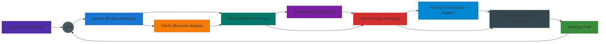

# SDD Pilot

[](LICENSE)
[](https://github.com/attilaszasz/sdd-pilot/releases/latest)
[](https://code.visualstudio.com/)
[](https://marketplace.visualstudio.com/items?itemName=GitHub.copilot)
[](https://github.com/attilaszasz/sdd-pilot/pulls)

Enhance your AI coding tool with a structured, spec-driven delivery workflow.

SDD Pilot helps you build features in phases instead of jumping straight to code. You start with a specification, clarify ambiguity, plan implementation, generate tasks, and only then implement.


```mermaid
flowchart LR
   Init["Init (Project Initializer)"] --> Start((Start))
   Start((Start)) --> S["Specify (Product Manager)"]
   S --> P["Plan (Software Architect)"]
   S --> C["Clarify (Business Analyst)"]
   C --> P
   P --> CH["Checklists (QA Engineer)"]
   CH --> T["Tasks (Project Manager)"]
   P --> T
   T --> A["Analyze (Compliance Auditor)"]
   A --> I["Implement (Software Engineer)"]
   T --> I
   I --> Code["Working Code"]
   Code --> Start

   %% Material Design Palette (Weight 700/800 for contrast)
   style Init fill:#512DA8,stroke:#311B92,color:#fff  %% Deep Purple
   style Start fill:#455A64,stroke:#263238,color:#fff %% Blue Grey
   style S fill:#1976D2,stroke:#0D47A1,color:#fff     %% Blue
   style C fill:#F57C00,stroke:#E65100,color:#fff     %% Orange
   style P fill:#00796B,stroke:#004D40,color:#fff     %% Teal
   style CH fill:#7B1FA2,stroke:#4A148C,color:#fff    %% Purple
   style T fill:#D32F2F,stroke:#B71C1C,color:#fff     %% Red
   style A fill:#0288D1,stroke:#01579B,color:#fff     %% Light Blue
   style I fill:#37474F,stroke:#263238,color:#fff     %% Dark Blue Grey
   style Code fill:#388E3C,stroke:#1B5E20,color:#fff  %% Green
```

> **Heritage:** SDD Pilot evolved from [Spec Kit](https://github.com/github/spec-kit) ([0.0.90](https://github.com/github/spec-kit/releases/tag/v0.0.90)).

## What is it

To guide you through [spec-driven development](https://www.linkedin.com/pulse/ai-augmented-spec-driven-development-lifecycle-attila-szász-64e9f/), SDD Pilot gives you:
- A guided phase-by-phase process
- Built-in quality gates (so you do not skip critical steps)
- Structured artifacts under `specs/<feature-folder>/`
- Specialized agents for each phase

> **Compatibility:** SDDP supports **GitHub Copilot**, **Antigravity**, **Windsurf**, **OpenCode**, and **Claude Code**.

## Prerequisites

### GitHub Copilot
- VS Code `1.109.x` or newer
- GitHub Copilot Chat extension installed and enabled
- Active GitHub Copilot access (Free, Pro, or Business)

### Antigravity
- Antigravity coding tool installed

### Windsurf
- Windsurf IDE installed

### OpenCode
- OpenCode IDE or CLI installed

### Claude Code
- Claude Code CLI installed
- Active Anthropic API key or Claude Max subscription

## Model recommendation

You do **not** need the most expensive model tiers for this workflow.

At the time of writing, **GPT-5.3-Codex** is the recommended model for all SDDP phases (`/sddp-init` through `/sddp-implement`).

## Getting Started

### 1) Add SDD Pilot to your repo

**Option A — Use the GitHub template** (includes files for all tools)

Click **Use this template** on the [SDD Pilot repository](https://github.com/attilaszasz/sdd-pilot) to create a new repo with all files included.

**Option B — Download the release for your AI tool**

1. Go to the [Releases page](https://github.com/attilaszasz/sdd-pilot/releases/latest).
2. Download the archive matching your tool:
   - **GitHub Copilot** → `sdd-pilot-copilot-vX.Y.Z.zip`
   - **Antigravity** → `sdd-pilot-antigravity-vX.Y.Z.zip`
   - **Windsurf** → `sdd-pilot-windsurf-vX.Y.Z.zip`
   - **OpenCode** → `sdd-pilot-opencode-vX.Y.Z.zip`
   - **Claude Code** → `sdd-pilot-claude-code-vX.Y.Z.zip`
3. Extract the contents to the root folder of your project.

### 2) Initialize project laws (`/sddp-init`)

Before building features, define your non-negotiable rules:

```text
/sddp-init My project is a Node.js monorepo using TypeScript.
Principles:
1. Test-Driven Development is mandatory.
2. All APIs must be RESTful.
3. No direct database access from controllers.
```

This populates `project-instructions.md`, which acts as project governance. Planning and analysis workflows check these rules.

If `/sddp-init` receives a file as input, that file is registered as the **Product Document** in `.github/sddp-config.md`.

Example (attach/select your product doc when running the command):

```text
/sddp-init Initialize project governance using attached PRD
```

## Core lifecycle

Use this flow for each feature:

```text
Specify → Clarify → Plan → Checklist (optional) → Tasks → Analyze (optional) → Implement
```

Copilot command mapping:

```text
/sddp-specify → /sddp-clarify → /sddp-plan → /sddp-checklist (optional) → /sddp-tasks → /sddp-analyze (optional) → /sddp-implement
```

### What each phase produces

| Phase | Role | Produces | Gate |
|-------|------|----------|------|
| **Specify** | Product Manager | `spec.md` | Feature description provided |
| **Clarify** | Business Analyst | Updated `spec.md` | `spec.md` exists |
| **Plan** | Software Architect | `plan.md`, `research.md`, `quickstart.md`, conditionally `data-model.md`, `contracts/` | `spec.md` exists |
| **Checklist** *(optional)* | QA Engineer | `checklists/*.md` | `spec.md` + `plan.md` exist |
| **Tasks** | Project Manager | `tasks.md` | `spec.md` + `plan.md` exist |
| **Analyze** *(optional)* | Compliance Auditor | Markdown report (no files modified) | `spec.md` + `plan.md` + `tasks.md` exist |
| **Implement** | Software Engineer | Source code, marked tasks | `spec.md` + `plan.md` + `tasks.md` exist |

All artifacts are written to `specs/<feature-folder>/`:

```
specs/<feature-folder>/
├── spec.md          # Feature specification (user stories, requirements, success criteria)
├── plan.md          # Implementation plan (tech context, architecture, instructions check)
├── tasks.md         # Phased task list (setup → foundational → user stories → polish)
├── research.md      # Technology research and decisions
├── data-model.md    # Entity definitions and relationships (conditional)
├── quickstart.md    # Integration scenarios and quick-start guide
├── contracts/       # API contracts (conditional)
└── checklists/      # Requirements quality checklists (*.md)
```

### Agent role mapping

| Command | Role | Shared Skill | Copilot | Antigravity | Windsurf | OpenCode | Claude Code |
|---|---|---|---|---|---|---|---|
| `/sddp-init` | Project Initializer | `init-project` | `project-initializer.md` | `sddp-init.md` | `sddp-init.md` | `sddp-project-initializer.md` | `sddp-init/SKILL.md` |
| `/sddp-specify` | Product Manager | `specify-feature` | `product-manager.md` | `sddp-specify.md` | `sddp-specify.md` | `sddp-product-manager.md` | `sddp-specify/SKILL.md` |
| `/sddp-clarify` | Business Analyst | `clarify-spec` | `business-analyst.md` | `sddp-clarify.md` | `sddp-clarify.md` | `sddp-business-analyst.md` | `sddp-clarify/SKILL.md` |
| `/sddp-plan` | Software Architect | `plan-feature` | `software-architect.md` | `sddp-plan.md` | `sddp-plan.md` | `sddp-software-architect.md` | `sddp-plan/SKILL.md` |
| `/sddp-checklist` | QA Engineer | `generate-checklist` | `qa-engineer.md` | `sddp-checklist.md` | `sddp-checklist.md` | `sddp-qa-engineer.md` | `sddp-checklist/SKILL.md` |
| `/sddp-tasks` | Project Manager | `generate-tasks` | `project-manager.md` | `sddp-tasks.md` | `sddp-tasks.md` | `sddp-project-manager.md` | `sddp-tasks/SKILL.md` |
| `/sddp-analyze` | Compliance Auditor | `analyze-compliance` | `compliance-auditor.md` | `sddp-analyze.md` | `sddp-analyze.md` | `sddp-compliance-auditor.md` | `sddp-analyze/SKILL.md` |
| `/sddp-implement` | Software Engineer | `implement-tasks` | `software-engineer.md` | `sddp-implement.md` | `sddp-implement.md` | `sddp-software-engineer.md` | `sddp-implement/SKILL.md` |
| `/sddp-taskstoissues` | Release Manager | `tasks-to-issues` | `release-manager.md` | `sddp-taskstoissues.md` | `sddp-taskstoissues.md` | `sddp-release-manager.md` | `sddp-tasks-to-issues/SKILL.md` |

- **Shared Skills** live in `.github/skills/<name>/SKILL.md` — tool-agnostic workflow logic
- **Copilot Wrappers** live in `.github/agents/` — tool mapping + sub-agent delegation
- **Antigravity Workflows** live in `.agents/workflows/` — loads shared skill and handles delegation inline
- **Windsurf Workflows** live in `.windsurf/workflows/` — loads shared skill and handles delegation inline
- **OpenCode Agents** live in `.opencode/agents/` — primary agents with sub-agent delegation + commands in `.opencode/commands/`
- **Claude Code Skills** live in `.claude/skills/` — skill entry points with Task-based sub-agent delegation + agents in `.claude/agents/`

### Deterministic prompt format

Agent files follow the same instruction layout to reduce ambiguity:

1. `Role`
2. `Task`
3. `Inputs`
4. `Execution Rules`
5. `Output Format`

## Feature folder convention

Feature folders are resolved as follows:

- If your current branch matches `#####-feature-name`, the Specify phase (`/sddp-specify`) uses `specs/<current-branch>/`.
- If your branch does not match that pattern, the Specify phase (`/sddp-specify`) prompts you to enter the feature folder name under `specs/` and validates new names in `00001-feature-name` format.

In both cases, artifacts are written to:

```text
specs/<feature-folder>/
```

Examples:

```text
Current branch: 00007-payment-flow
Run Specify phase: /sddp-specify Add one-click checkout
→ Uses specs/00007-payment-flow/
```

```text
Current branch: feature/payment-flow
Run Specify phase: /sddp-specify Add one-click checkout
→ Prompts for feature folder name (for example: 00007-payment-flow)
→ Uses specs/00007-payment-flow/
```

Expected branch pattern:

```text
#####-feature-name
```

Example:

```text
00001-user-auth
```

Feature folder naming policy:

- New feature folders must use `00001-feature-name` format.
- Existing non-prefixed folders are grandfathered and can still be selected when they already exist.

Migration note:

- No bulk rename is required for existing non-prefixed folders.
- Prefix enforcement applies to newly created feature folders.

## Gates (why this flow is reliable)

SDDP enforces order:

- You cannot run planning without `spec.md`
- You cannot generate tasks without `plan.md`
- You cannot implement without `tasks.md`
- Project instructions in `project-instructions.md` are treated as law
- If checklists exist and are incomplete, implementation can be gated

## Understanding `.github/sddp-config.md`

`.github/sddp-config.md` stores project-level context shared across SDDP agents.

It has two key document references:

1. **Product Document path**
   - Used to enrich feature specification context
2. **Technical Context Document path**
   - Used by planning and downstream agents for architecture/stack constraints

Important behavior:
- This file is managed by `/sddp-init` and `/sddp-plan`
- If `/sddp-init` receives a file, that file is stored as the **Product Document** path
- If `/sddp-plan` receives a file, that file is stored as the **Technical Context Document** path
- When those files are supplied, agents use their content to build `spec.md` and `plan.md`
- Empty paths are normal when starting a new project
- If referenced files are moved or missing, agents continue best-effort and may warn

Example (attach/select your technical context doc when planning):

```text
/sddp-plan Create implementation plan using attached technical context
```

## Typical day-to-day command sequence

1. Create a feature branch: `git checkout -b 00001-user-auth`
2. Run:
   - `/sddp-specify Build user authentication with email/password`
   - `/sddp-clarify`
   - `/sddp-plan`
   - `/sddp-checklist` (optional but recommended)
   - `/sddp-tasks`
   - `/sddp-analyze` (optional but recommended)
   - `/sddp-implement`
3. (Optional) Run `/sddp-taskstoissues` to convert tasks into GitHub issues (requires GitHub MCP setup)

> **Interrupted?** Re-run `/sddp-implement` in a new chat session.
> Completed tasks (marked `[X]` in `tasks.md`) are automatically skipped.

> **Same chat or new chat?** Both work. Each SDDP command resets its context
> automatically — running `/sddp-plan` after `/sddp-specify` in the same chat
> is fine. A new chat session is only recommended for `/sddp-specify` when starting
> a brand-new feature.

## Troubleshooting

**“Agent not found”**
- Confirm VS Code and Copilot Chat extension are up to date
- Ensure `.github/agents/` exists in the workspace

**“Spec/Plan/Tasks not found”**
- Verify you are on the correct branch
- If branch is non-matching, re-run `/sddp-specify` and provide the intended feature folder name
- Confirm artifacts exist under the selected feature folder in `specs/`

**“No feature branch detected”**
- Check detached HEAD state: `git rev-parse --abbrev-ref HEAD`
- Confirm the active VS Code workspace matches your repository
- If branch remains non-matching, provide feature folder name when prompted by `/sddp-specify`

**“/sddp-taskstoissues failed”**
- Configure GitHub MCP server in `.vscode/mcp.json` (Copilot) or `.mcp.json` (Claude Code)

**Claude Code: "Skill not found"**
- Ensure `.claude/skills/` exists in the workspace root
- Verify `CLAUDE.md` is present at the repo root
- Run `claude` from the project directory (skills are discovered relative to CWD)

## Extra references

- Workflow and lifecycle reference: `AGENTS.md`
- Governance file: `project-instructions.md`
- Shared project context: `.github/sddp-config.md`
- Specs file conventions: `.github/instructions/sddp-specs.instructions.md`

