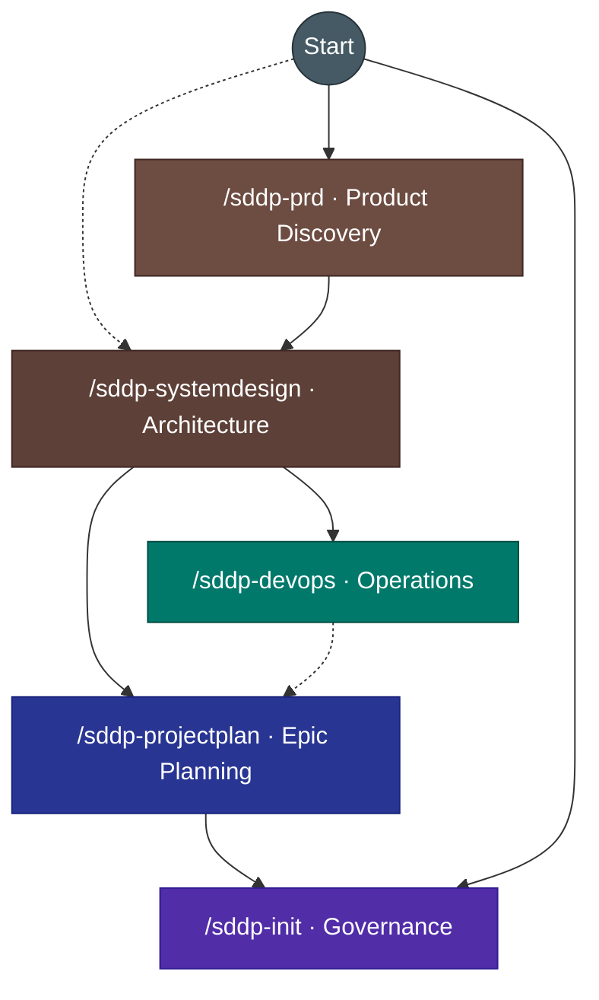
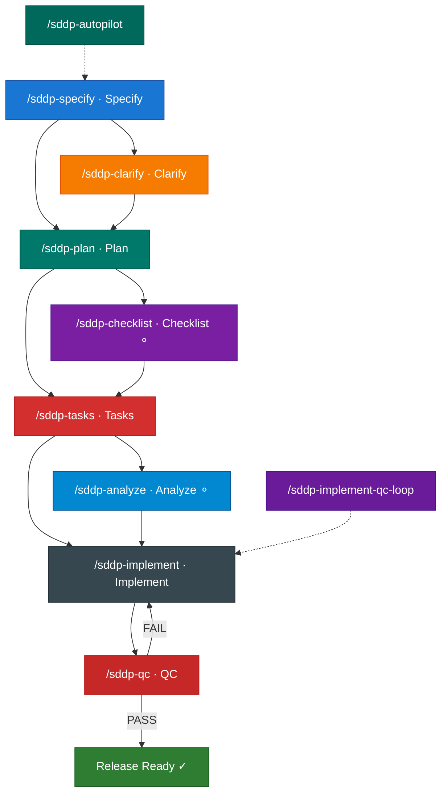

# SDD Pilot

[](LICENSE)
[](https://github.com/attilaszasz/sdd-pilot/releases/latest)
[](https://code.visualstudio.com/)
[](https://marketplace.visualstudio.com/items?itemName=GitHub.copilot)
[](https://geminicli.com/)
[](https://developers.openai.com/codex)
[](https://github.com/attilaszasz/sdd-pilot/pulls)

Enhance your AI coding tool with a structured, spec-driven delivery workflow.

## What is SDD Pilot?

Most AI coding tools jump straight to code. SDD Pilot adds a [spec-driven development](https://www.linkedin.com/pulse/ai-augmented-spec-driven-development-lifecycle-attila-szász-64e9f/) layer on top — so you specify *what* to build before *how* to build it.

- **Phase-by-phase process** — each feature moves through Specify → Plan → Tasks → Implement → QC
- **Quality gates** — you cannot skip ahead; each phase requires the previous phase's artifacts
- **Structured artifacts** — specs, plans, tasks, and QC reports live under `specs/<feature-folder>/`
- **Specialized agents** — a dedicated role (Product Manager, Architect, Engineer, QC) handles each phase
- **Autopilot mode** — run the full pipeline unattended with a single command

> **Compatibility:** Works with **GitHub Copilot**, **Gemini CLI**, **Antigravity**, **Windsurf**, **OpenCode**, **Claude Code**, and **OpenAI Codex**.

> **Heritage:** SDD Pilot evolved from [Spec Kit](https://github.com/github/spec-kit) ([0.0.90](https://github.com/github/spec-kit/releases/tag/v0.0.90)).

---

## How It Works

SDD Pilot has two workflows: an optional **project bootstrap** to set up shared context, and the **feature delivery** lifecycle you repeat for each feature.

### Project Bootstrap (optional)

Set up reusable product, architecture, and operations context before building features.


```mermaid
flowchart TB
   B((Start)) --> PRD["/sddp-prd · Product Discovery"]
   B -.-> SA
   PRD --> SA["/sddp-systemdesign · Architecture"]
   SA --> DO["/sddp-devops · Operations"]
   SA --> PP["/sddp-projectplan · Epic Planning"]
   DO -.-> PP
   PP --> Init["/sddp-init · Governance"]
   B --> Init

   style B fill:#455A64,stroke:#263238,color:#fff
   style PRD fill:#6D4C41,stroke:#3E2723,color:#fff
   style SA fill:#5D4037,stroke:#3E2723,color:#fff
   style DO fill:#00796B,stroke:#004D40,color:#fff
   style PP fill:#283593,stroke:#1A237E,color:#fff
   style Init fill:#512DA8,stroke:#311B92,color:#fff
```

| Command | What it does |
|---------|-------------|
| `/sddp-prd` | Turns a rough product idea into a canonical PRD (`specs/prd.md`) |
| `/sddp-systemdesign` | Creates the Software Architecture Document (`specs/sad.md`) |
| `/sddp-devops` | Defines deployment & operations context (`specs/dod.md`) |
| `/sddp-projectplan` | Decomposes the project into prioritized epics (`specs/project-plan.md`) |
| `/sddp-init` | Sets up project governance rules (`project-instructions.md`) |

All bootstrap steps except `/sddp-init` are optional. You can jump straight to `/sddp-init` and start delivering features.

### Feature Delivery

The core lifecycle you run for each feature:


```mermaid
flowchart TB
   S["/sddp-specify · Specify"] --> C["/sddp-clarify · Clarify"]
   S --> P["/sddp-plan · Plan"]
   C --> P
   P --> CH["/sddp-checklist · Checklist ⚬"]
   P --> T["/sddp-tasks · Tasks"]
   CH --> T
   T --> A["/sddp-analyze · Analyze ⚬"]
   T --> I["/sddp-implement · Implement"]
   A --> I
   I --> QC["/sddp-qc · QC"]
   QC -->|PASS| R["Release Ready ✓"]
   QC -->|FAIL| I

   Auto["/sddp-autopilot"] -.-> S
   Loop["/sddp-implement-qc-loop"] -.-> I

   style S fill:#1976D2,stroke:#0D47A1,color:#fff
   style C fill:#F57C00,stroke:#E65100,color:#fff
   style P fill:#00796B,stroke:#004D40,color:#fff
   style CH fill:#7B1FA2,stroke:#4A148C,color:#fff
   style T fill:#D32F2F,stroke:#B71C1C,color:#fff
   style A fill:#0288D1,stroke:#01579B,color:#fff
   style I fill:#37474F,stroke:#263238,color:#fff
   style QC fill:#C62828,stroke:#B71C1C,color:#fff
   style R fill:#2E7D32,stroke:#1B5E20,color:#fff
   style Auto fill:#00695C,stroke:#004D40,color:#fff
   style Loop fill:#6A1B9A,stroke:#4A148C,color:#fff
```

*Phases marked ⚬ are optional but recommended.*

| Phase | Command | What it produces |
|-------|---------|-----------------|
| **Specify** | `/sddp-specify` | `spec.md` — user stories, requirements, success criteria |
| **Clarify** | `/sddp-clarify` | Updated `spec.md` with resolved ambiguities |
| **Plan** | `/sddp-plan` | `plan.md` — architecture decisions, tech context |
| **Checklist** | `/sddp-checklist` | `checklists/*.md` — requirements quality checks |
| **Tasks** | `/sddp-tasks` | `tasks.md` — phased, dependency-ordered task list |
| **Analyze** | `/sddp-analyze` | Consistency report (no files modified) |
| **Implement** | `/sddp-implement` | Source code with tasks marked complete |
| **QC** | `/sddp-qc` | `qc-report.md` — tests, lint, security, traceability |

### Quality Gates

Each phase requires the previous phase's output:

- No planning without `spec.md`
- No tasks without `plan.md`
- No implementation without `tasks.md`
- No QC without `.completed` (set when all tasks pass)
- No release without `.qc-passed`
- If QC fails, `.completed` is removed and `[BUG]` tasks are injected into `tasks.md`
- `project-instructions.md` rules are enforced throughout

### Autopilot

Run the entire feature-delivery pipeline unattended:

```text
/sddp-autopilot Build user authentication with email/password
```

**Requires:** Autopilot enabled in `.github/sddp-config.md`, plus a registered Product Document and Technical Context Document. If either is missing, run `/sddp-prd` and/or `/sddp-systemdesign` first.

Autopilot is provided through the repository's tool-specific workflow wrappers; there is no separate standalone `orchestrator/` package.

---

## Getting Started

### Prerequisites

| Tool | Requirements |
|------|-------------|
| **GitHub Copilot** | VS Code ≥ 1.109, Copilot Chat extension, active Copilot access |
| **Gemini CLI** | Gemini CLI installed |
| **Antigravity** | Antigravity installed |
| **Windsurf** | Windsurf IDE installed |
| **OpenCode** | OpenCode IDE or CLI installed |
| **OpenAI Codex** | Codex CLI installed (`npm i -g @openai/codex`), active ChatGPT plan or OpenAI API key |
| **Claude Code** | Claude Code CLI, active Anthropic API key or Claude Max subscription |

> **Tip — environment setup:** Run `/sddp-devsetup` to analyze your repo and get a guided setup walkthrough.

> **Tip — model choice:** You do not need the most expensive tiers. Recommended **GPT-5.4** or **Claude Sonnet 4.6**  

### Installation

1. Go to the [Releases page](https://github.com/attilaszasz/sdd-pilot/releases/latest).
2. Download the archive for your tool:
   - **GitHub Copilot** → `sdd-pilot-copilot-vX.Y.Z.zip`
   - **Antigravity** → `sdd-pilot-antigravity-vX.Y.Z.zip`
   - **Windsurf** → `sdd-pilot-windsurf-vX.Y.Z.zip`
   - **OpenCode** → `sdd-pilot-opencode-vX.Y.Z.zip`
   - **OpenAI Codex** → `sdd-pilot-codex-vX.Y.Z.zip`
   - **Claude Code** → `sdd-pilot-claude-code-vX.Y.Z.zip`
   - **Gemini CLI** → `gemini extensions install https://github.com/attilaszasz/sdd-pilot`

3. Extract the archive contents to your project root.

### Quick Start

```bash
# 1. Initialize project governance
#    (optionally run /sddp-prd and /sddp-systemdesign first for richer context)
```
```text
/sddp-init My project is a Node.js monorepo using TypeScript.
```

```bash
# 2. Create a feature branch and deliver a feature
git checkout -b 00001-user-auth
```
```text
/sddp-specify Build user authentication with email/password
/sddp-clarify
/sddp-plan
/sddp-tasks
/sddp-implement
/sddp-qc
```

Or replace the feature commands with a single autopilot run:
```text
/sddp-autopilot Build user authentication with email/password
```

> **QC feedback loop:** If `/sddp-qc` fails, it injects `[BUG]` tasks and removes `.completed`. Run `/sddp-implement` again, then re-run `/sddp-qc`. Or use `/sddp-implement-qc-loop` to automate this cycle (up to 10 iterations).

> **Interrupted?** Re-run `/sddp-implement` in a new chat. Completed tasks (marked `[X]`) are automatically skipped.

> **Same chat or new chat?** Both work. Each command resets its context. A new chat is only recommended for `/sddp-specify` when starting a brand-new feature.

---

## Feature Workspaces

Each feature gets its own workspace under `specs/`. The workspace name is derived from your git branch:

```text
Branch: 00001-user-auth  →  specs/00001-user-auth/
```

New workspaces must use the `#####-feature-name` format (e.g. `00001-user-auth`). If your branch doesn't match this pattern, `/sddp-specify` will prompt you for a name.

## Reference

- [Full reference documentation](docs/reference.md) — agent role mapping, artifact taxonomy, sddp-config internals, workspace conventions
- [Lifecycle and governance rules](AGENTS.md)
- [Shared project context](.github/sddp-config.md)
- [Specs file conventions](.github/instructions/sddp-specs.instructions.md)
