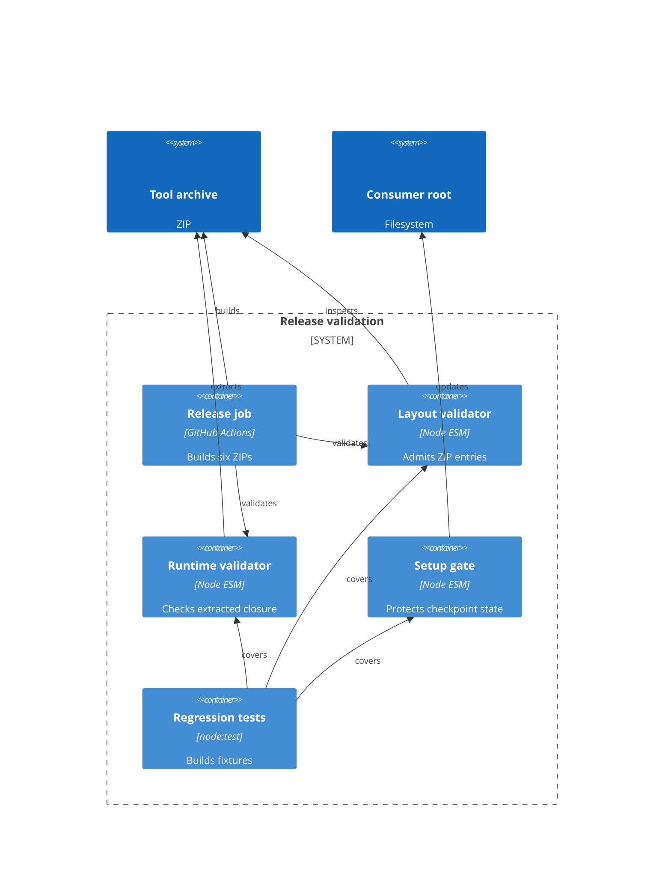

# Implementation Plan: Release Archive Hardening

**Branch**: `00001-release-archive-hardening` | **Date**: 2026-08-13 | **Spec**: [spec.md](spec.md)

## Summary

**Goal**: Reject unsafe release archives, prove packaged ESM runtime closure, and preserve consumer ignore rules.  
**Approach**: Admit ZIP entries before temporary extraction, validate extracted module closure/importability, then set ignore protection through setup.  
**Key Constraint**: Preserve six direct-root archive layouts and existing consumer `.gitignore` bytes.

## Technical Context

**Language/Version**: Node.js 20 ESM (release workflow)  
**Primary Dependencies**: Node standard library; `zip` and `unzip` CLI  
**Storage**: N/A — transient ZIP extraction only  
**Testing**: `node:test` and `node:assert/strict`  
**Target Platform**: GitHub Actions Ubuntu release runner; consumer project roots  
**Project Type**: single  
**Project Mode**: brownfield  
**Performance Goals**: Validate six archives within release-job duration  
**Constraints**: Archive-derived bytes; relative ESM only; fail before unsafe extraction  
**Scale/Scope**: Six tool ZIPs; runtime `.mjs` closure per archive

## Instructions Check

| Check | Status | Evidence |
|-------|--------|----------|
| Agent output | PASS | Tables and bounded tagged hints. |
| Artifact rules | PASS | Required plan sections, stable requirement IDs, ≤10KB target. |
| Technology policy | PASS | Template project instructions declare no concrete conflicting stack policy. |
| Post-design audit | PASS | No plan decision violates an instantiated project principle. |

## Architecture



## Architecture Decisions

| ID | Decision | Options Considered | Chosen | Rationale |
|----|----------|--------------------|--------|-----------|
| AD-001 | ZIP admission order | Extract first / inspect then extract | Inspect entries before extraction | Rejects traversal, symlinks, and wrappers before unsafe output. |
| AD-002 | ESM closure proof | Source scan / extracted scan and import | Extracted scan and import | Proves the archive bytes contain a loadable local closure. |
| AD-003 | Ignore protection | Package root `.gitignore` / setup helper | Idempotent setup helper | Cannot replace consumer ignore rules. |

## Data Model Summary

N/A — no persistent data; archive entries and module closure are transient validation values.

## API Surface Summary

| Interface | Consumer | Purpose | Detail |
|-----------|----------|---------|--------|
| Internal Node module API | Release workflow and tests | ZIP admission, ESM closure, extracted importability, ignore setup | [contracts/archive-validation.md](contracts/archive-validation.md) |

## Testing Strategy

| Tier | Tool | Scope | Mock Boundary | Install |
|------|------|-------|---------------|---------|
| Unit | `node --test` | Entry admission, closure traversal, ignore mutation | Temp ZIPs and temp directories | configured |
| Integration | `node --test` | Build/list/extract/validate all six archives | `zip`/`unzip` CLI | configured |
| Security | `node --test` | Traversal and symlink rejection | Crafted ZIP metadata | configured |
| Coverage | N/A | No coverage tool configured; behavior matrix is required | — | N/A |

## Acceptance Test Stubs

| Req ID | Test File | Stub Blocks (framework-native) | RED Status |
|--------|-----------|----------------------------------|------------|
| TR-001 | tests/release-archive-layout.test.mjs | `test('TR-001 rejects wrapper and mixed-wrapper archives', ...)` | failing-assertion |
| TR-002 | tests/release-archive-layout.test.mjs | `test('TR-002 admits only safe direct-root archives', ...)` | failing-assertion |
| TR-003 | tests/release-runtime-manifest.test.mjs | `test('TR-003 resolves static and literal dynamic local closure', ...)` | failing-assertion |
| TR-004 | tests/release-runtime-manifest.test.mjs | `test('TR-004 rejects absent or unimportable local modules', ...)` | failing-assertion |
| TR-005 | tests/release-runtime-manifest.test.mjs | `test('TR-005 validates extracted archive module bytes', ...)` | failing-assertion |
| TR-006 | tests/release-runtime-manifest.test.mjs | `test('TR-006 preserves consumer ignore bytes and adds one rule', ...)` | failing-assertion |
| TR-007 | tests/release-runtime-manifest.test.mjs | `test('TR-007 leaves read-only ignore files unchanged', ...)` | failing-assertion |

## Error Handling Strategy

| Error Category | Pattern | Response | Retry |
|----------------|---------|----------|-------|
| Archive admission | fail-fast | Throw named entry error; no extraction | no |
| Module closure | aggregate then fail | Report unresolved specifier/import failure | no |
| Consumer ignore | fail-safe | Throw without truncation or replacement | no |

## Integration Points

| Spec Reference | System/Service | Technical Approach | Contract |
|----------------|----------------|--------------------|----------|
| IP-001 | `.github/workflows/release.yml` | Run admission and extracted-runtime validators after each build | `assertReleaseArchiveLayout`, `validateReleaseArchive` |
| IP-002 | Implement setup gate | Call ignore helper before `.implement-state` checkpoint write | `ensureImplementStateIgnored` |
| IP-003 | Packaged runtime files | Discover/import relative `.mjs` closure in extracted temp root | `discoverLocalModuleClosure` |

## Risk Mitigation

| Risk (from spec) | Likelihood | Impact | Mitigation | Owner |
|-------------------|------------|--------|------------|-------|
| Unsupported dynamic import expression | M | M | Traverse only string literals; explicitly exclude non-literal expressions from local closure. | Runtime validator |
| Platform-specific ZIP metadata | L | H | Use release-runner `unzip` listing metadata and fixtures for unsafe path and symlink entries. | Layout validator |
| Read-only ignore file handling | M | M | Check appendability; on failure preserve original bytes and throw before checkpointing. | Setup gate |

## Requirement Coverage Map

| Req ID | File Path(s) / Component(s) | Function(s)/Symbol(s) | Notes |
|--------|------------------------------|------------------------|-------|
| TR-001 | scripts/assert-release-archive-layout.mjs; tests/release-archive-layout.test.mjs — Layout validator | `assertSafeArchiveEntries(tool, entries)`; `assertReleaseArchiveLayout(tool, archivePath)` | AD-001 |
| TR-002 | scripts/assert-release-archive-layout.mjs; tests/release-archive-layout.test.mjs — Layout validator | `inspectArchiveEntries(archivePath)`; `assertReleaseArchiveLayout(tool, archivePath)` | AD-001 |
| TR-003 | scripts/release-runtime-manifest.mjs; tests/release-runtime-manifest.test.mjs — Runtime validator | `discoverLocalModuleClosure(directory, entries)` | AD-002 |
| TR-004 | scripts/release-runtime-manifest.mjs; tests/release-runtime-manifest.test.mjs — Runtime validator | `validateExtractedRelease(directory)`; `validateReleaseArchive(archivePath)` | AD-002 |
| TR-005 | scripts/release-runtime-manifest.mjs; tests/release-runtime-manifest.test.mjs — Runtime validator | `validateReleaseArchive(archivePath)` | AD-002 |
| TR-006 | .github/skills/implement-tasks/references/gates.md; tests/release-runtime-manifest.test.mjs — Setup gate | `ensureImplementStateIgnored(projectRoot)` | AD-003 |
| TR-007 | .github/skills/implement-tasks/references/gates.md; tests/release-runtime-manifest.test.mjs — Setup gate | `ensureImplementStateIgnored(projectRoot)` | AD-003 |
| TR-008 | .github/workflows/release.yml; tests/release-archive-layout.test.mjs; tests/release-runtime-manifest.test.mjs; tests/lifecycle-release-e2e.test.mjs — Release regression | `assertReleaseArchiveLayout`; `validateReleaseArchive`; `ensureImplementStateIgnored` | Matrix |

## Project Structure

### Source Code

```text
~ .github/workflows/release.yml
~ .github/skills/implement-tasks/references/gates.md
~ scripts/assert-release-archive-layout.mjs
~ scripts/release-runtime-manifest.mjs
~ tests/release-archive-layout.test.mjs
~ tests/release-runtime-manifest.test.mjs
~ tests/lifecycle-release-e2e.test.mjs
```

**Patterns to reuse**: Synchronous Node ESM CLI exports, `spawnSync`, temporary fixture cleanup.  
**Tests to extend**: `release-archive-layout.test.mjs`, `release-runtime-manifest.test.mjs`, `lifecycle-release-e2e.test.mjs`.  
**Naming conventions**: `RRM-###` and `RAL-###` test labels; `validate*` and `assert*` exports.

## Implementation Hints

- **[HINT-001]** Order: Inspect ZIP paths and symlink metadata before `unzip -d`.
- **[HINT-002]** Gotcha: Treat mixed valid-root-plus-wrapper archives as wrapper failures, not root successes.
- **[HINT-003]** Compatibility: Relative Node ESM specifiers require explicit extensions; ignore package and `node:` specifiers.
- **[HINT-004]** Constraint: Import the extracted module files, never their source-tree counterparts.
- **[HINT-005]** Order: Ensure `.implement-state` is ignored before writing `.implement-state`.
