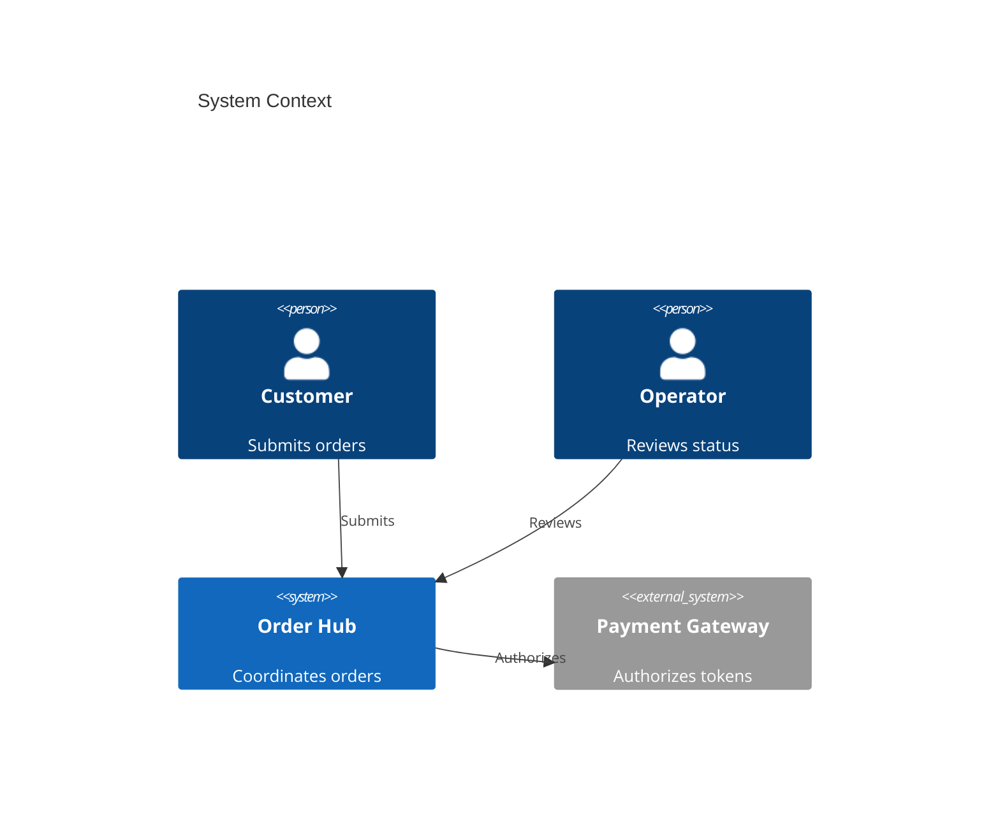
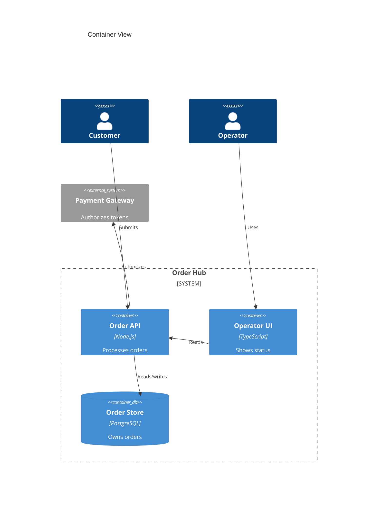
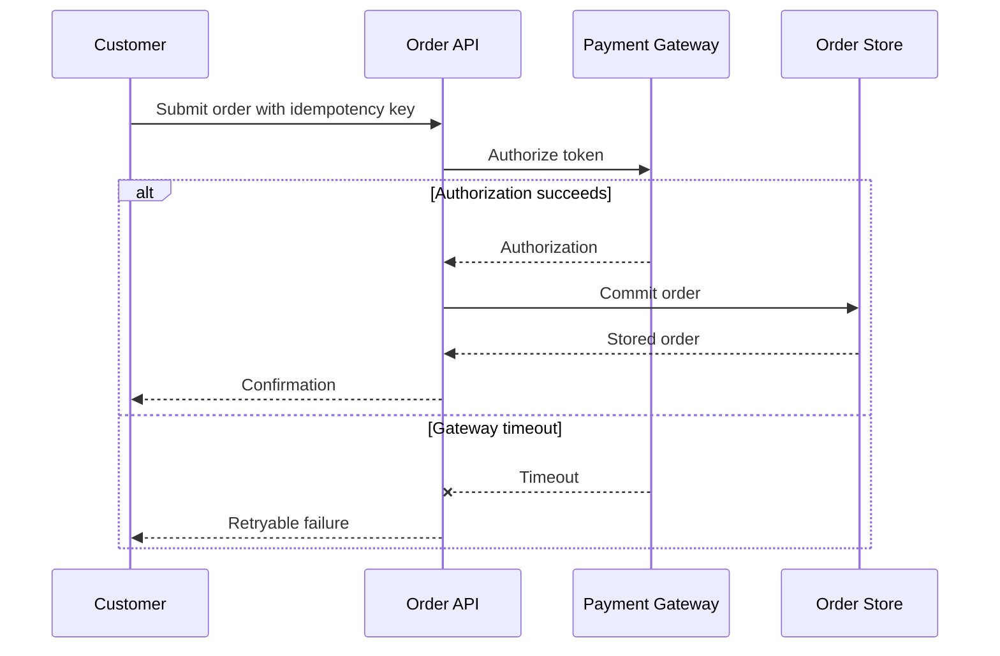
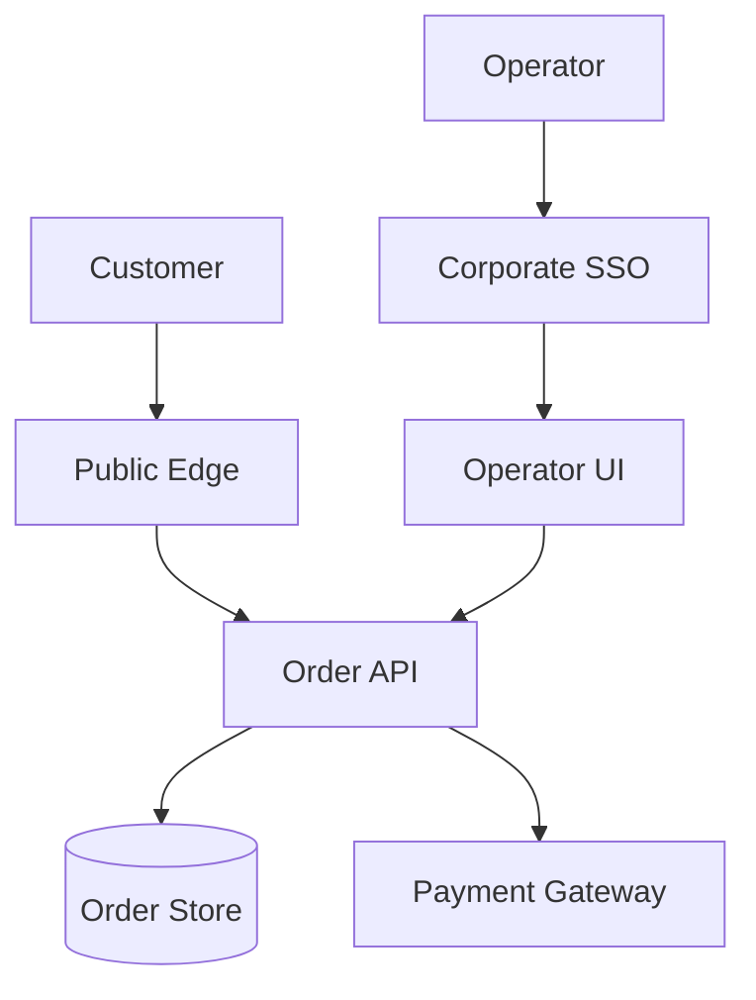

# Software Architecture Document: Order Hub

## Purpose and Scope

Order Hub accepts customer orders, coordinates payment authorization, and exposes order status. Fulfillment and payment processing remain external.

## Technical Context

**Language/Version**: TypeScript 5.8 on Node.js 22 
**Primary Dependencies**: Fastify 5, PostgreSQL client, OpenTelemetry 
**Storage**: PostgreSQL 17 owned by Order API 
**Testing**: Node test runner and Playwright contract journeys 
**Target Platform**: Linux containers on managed Kubernetes 
**Project Type**: Web platform 
**Performance Goals**: Order submission below 250 ms p95 at 200 requests per second 
**Constraints**: Payment data remains tokenized and deployment stays in one region 
**Scale/Scope**: 100,000 orders per day and 20 internal operators

## System Decomposition

| Boundary | Responsibilities | Data Ownership | Exposed Interfaces | Dependencies | Deployment Independence |
|----------|------------------|----------------|--------------------|--------------|-------------------------|
| Order API | Validate and persist orders | Orders and status history | HTTPS API | Payment Gateway | Independent container |
| Operator UI | Display order status | N/A | Browser UI | Order API | Independent static client |

## System Scope and Context

Customers submit orders through the public edge. Operators inspect status through an authenticated internal client. Payment Gateway is an external tokenized payment dependency.

### C4 System Context

### C4 Container View

## Architecture View Catalog

| View | Concern | Scope | Notation | Rationale |
|------|---------|-------|----------|-----------|
| System Context | Actors and external dependencies | Whole system | C4 Context | Establishes ownership |
| Container View | Runtime and storage boundaries | Whole system | C4 Container | Establishes deployables |
| Order Submission | Temporal behavior and recovery | Order API | Sequence | Explains the critical path |

## Solution Strategy and Architecture Style

- **Architecture Style**: Modular service with a separately deployed operator client
- **Source Code Layout**: Existing packages under `apps/api` and `apps/operator`
- **Why this style fits**: One transactional owner keeps order consistency simple while clients scale independently.
- **Alternatives considered**: Separate order and status services were rejected because they add distributed consistency without current scale pressure.

## Major Data Flow Catalog

| Flow ID | Trigger | Source / Actor | Processing Boundaries | Stores | Egress | Trust / Data Class | Consistency / Transaction | Failure / Recovery | Diagram |
|---------|---------|----------------|-----------------------|--------|--------|--------------------|---------------------------|--------------------|---------|
| FLOW-001 | Customer submits an order | Public customer | Public edge to Order API to Payment Gateway | Order Store | Order confirmation | Public to private; confidential order data | One local order transaction after authorization | Gateway timeout returns a retryable response; duplicate keys provide idempotency | FLOW-001 |

## Major Data Flow Diagrams

### FLOW-001: Order Submission

The API retries no payment calls automatically. A repeated customer request uses the idempotency key to recover the prior result without creating another order.

## Deployment and Trust Topology

The public edge terminates transport security. The API and store run in a private namespace. Regional failover is deferred because the approved target is one region.

## Cross-Cutting Concerns

### Security

OIDC authenticates operators, customer requests are rate limited, and payment details remain tokenized outside Order Hub.

### Reliability

Idempotency keys prevent duplicate orders. Database backups support a 4 hour RPO and 8 hour RTO.

### Observability

Trace identifiers connect edge, API, payment, and database spans. Alerts cover error rate, latency, and payment dependency failures.

### Data Management

Order API owns order records. Daily backups retain 30 days, and customer deletion requests anonymize retained operational records.

### Integration Strategy

Payment calls use a versioned HTTPS contract, bounded timeouts, and token-only payloads.

### Operations

The platform team owns runtime availability; the product team owns application alerts and runbooks. Environment mechanics belong in the DOD.

## Quality Attributes

| Attribute | Target | Measurement | Architectural Response |
|-----------|--------|-------------|------------------------|
| Performance | Below 250 ms p95 | Edge request histogram | Keep one local transaction |
| Reliability | 99.9% monthly availability | Availability SLI | Use health checks and bounded dependencies |
| Security | 100% tokenized payment references | Payload audit | Reject raw payment details |
| Maintainability | Zero cyclic package dependencies | Architecture test | Enforce package boundaries |
| Scalability | 200 requests per second | Load test | Scale API replicas horizontally |

## Architecture Traceability

| Capability / Objective | Boundary | Major Flow | Quality Target | ADRs |
|------------------------|----------|------------|----------------|------|
| Submit and track orders | Order API | FLOW-001 | Below 250 ms p95 and 99.9% availability | N/A |

## Architecture Decision Records

Project-level architectural decisions are maintained as standalone MADR files under `specs/adrs/`. This table is the index.

| ADR ID | Title | Status | Date | Supersedes | File |
|--------|-------|--------|------|------------|------|
| N/A | No durable decisions yet | proposed | 2026-08-20 | - | N/A |

## Risks, Assumptions, Constraints, and Open Questions

### Risks

- Payment Gateway latency can exhaust the request budget.

### Assumptions

- Payment tokens remain valid for the duration of one request.

### Constraints

- The initial deployment remains in one region.

### Open Questions

- Regional expansion requires a new availability and residency review.

## Project Context Baseline Updates

- No downstream technical baselines have been promoted yet.
